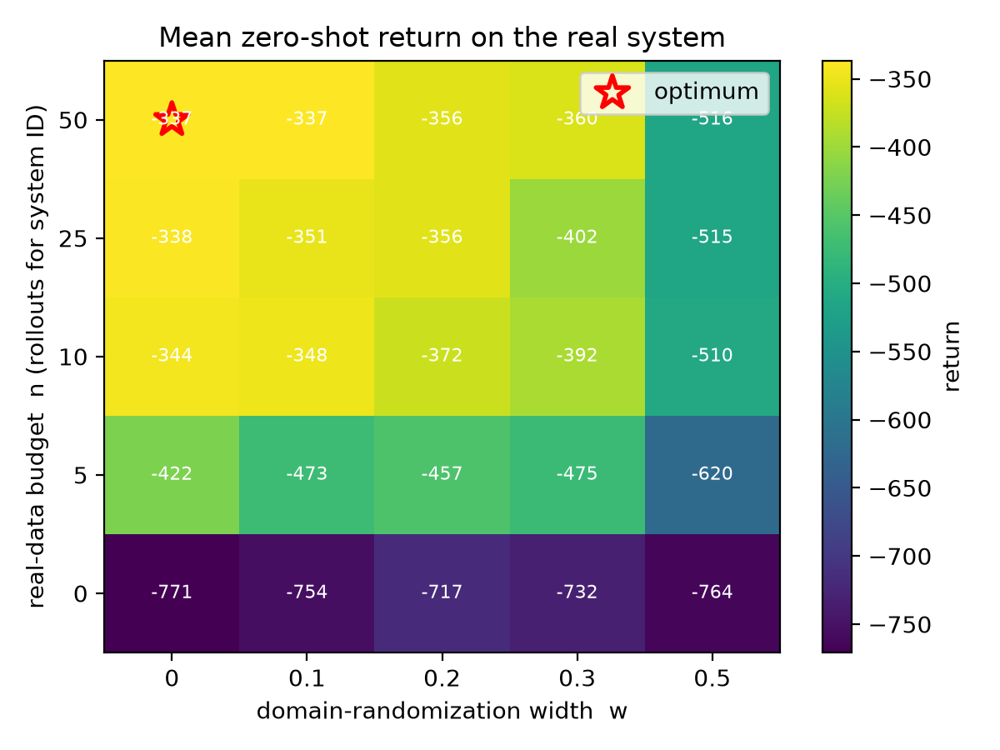
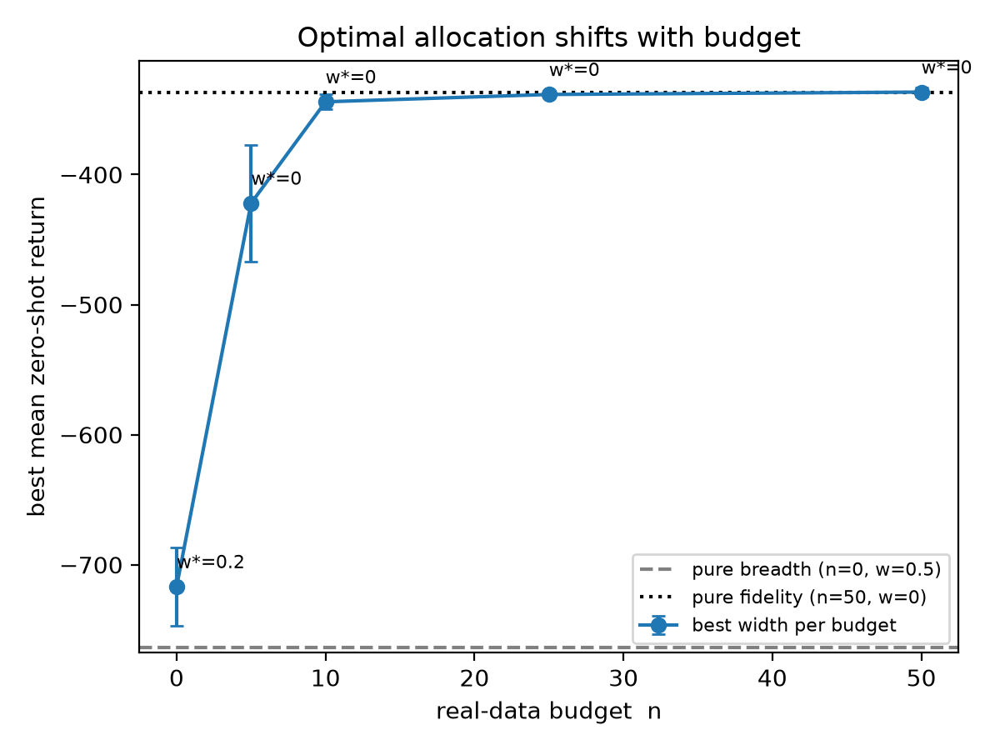

# Budgeted Sim-to-Real: Domain-Randomization Breadth vs. Simulator Fidelity

Domain-randomization *breadth* and simulator *fidelity* (system identification)
are usually pursued in isolation, yet both draw on the same scarce resource —
real-world interaction. Given a fixed budget of real rollouts, how should it be
split? We study this on a controlled `ParamPendulum` task (a sim-to-sim proxy for
sim-to-real) and map the zero-shot return surface over the (budget `n`,
randomization width `w`) grid.

## The two levers

- **`n`** — real-world rollouts spent on system identification. More rollouts →
  better point estimate `theta_hat` → higher *fidelity*.
- **`w`** — domain-randomization half-width around `theta_hat` (relative). Larger
  `w` → more *breadth* (robust but suboptimal). Free in simulation.

`n = 0` trains around the nominal prior (no identification); `w = 0` trains at the
point estimate only. The interesting regime is the interior.

## Results

Latest run: `theta* = (mass 2.0, length 1.5)`, 250 runs (5 budgets × 5 widths ×
10 seeds), SAC learner.





In this well-specified, identifiable regime, spending the budget on **system
identification dominates estimate-centered randomization breadth**. At `w = 0`,
going from no identification to a full budget improves zero-shot return by
**+434 (95% CI [+415, +458])**, with most of the gain realized by ~10 rollouts
(`n = 0` → `n = 10`: +427 [+407, +448]). Breadth does not substitute: `w = 0` is
optimal at every budget `n ≥ 5`, and the widest band (`w = 0.5`) significantly
hurts at every positive budget. Breadth helps only marginally — and not
significantly — when no identification is possible at all (`n = 0`, best `w =
0.2`, +54 [-4, +114]). All CIs are paired bootstraps over the 10 matched seeds.

Practical rule for this regime: **measure first; randomize the residual
uncertainty.**

## Quick start

```bash
pip install -r requirements.txt        # or: conda env create -f environment.yml
bash run_local.sh
```

`run_local.sh` runs a handful of configs with tiny timesteps and the fast "ideal"
identifier, then writes `results/smoke_summary.csv` and `results/smoke_figures/`.

## Reproducing the full results

```bash
# Run the 250-run grid (sequential; parallelize across the task ids as you like).
for TID in $(seq 0 $(($(python -m src.config | sed -n 's/TOTAL_JOBS=//p') - 1))); do
    python -m src.train --task_id "$TID" --output_root results/sweep
done

python -m src.aggregate --output_root results/sweep --out results/summary.csv
python -m src.stats     --summary results/summary.csv      # CIs for every claim
python -m src.plot      --summary results/summary.csv --outdir results/figures
```

Each run decodes its own `(n, w, seed)` from the task id via
`config.decode_task_id`, so any executor — a shell loop, GNU parallel, or a job
scheduler — sweeps the grid without a separate index file. Re-running is
idempotent: a run whose `result.json` is `status: ok` is skipped, so a partial
sweep can be resumed safely.

## Layout

```
src/
  config.py          grid + constants + task_id <-> (n, w, seed) mapping (single source of truth)
  param_pendulum.py  Pendulum env with settable (mass, length)
  dr_wrapper.py      domain-randomization reset wrapper
  system_id.py       estimate theta_hat from n real rollouts (grid ID, or "ideal" ablation)
  train.py           one run: ID -> DR-train -> zero-shot eval -> result.json
  evaluate.py        zero-shot evaluation on the real system
  aggregate.py       collect result.json files -> summary.csv
  stats.py           per-cell SEM + paired-bootstrap CIs for the reported contrasts
  plot.py            heatmap.png + pareto.png
  make_manifests.py  emit run lists for the robustness experiments
run_local.sh         quick local smoke test
results/             aggregated CSVs + figures (raw per-run artifacts are gitignored)
```

## Grid and configuration

`n ∈ {0, 5, 10, 25, 50}` × `w ∈ {0, 0.1, 0.2, 0.3, 0.5}` × `seed ∈ {0..9}` =
250 runs. The learner is SAC (`total_timesteps = 75000`); the reality gap is
`theta* = (2.0, 1.5)` with sensor noise `1.0`. Everything is defined in
`src/config.py` — edit only that file to change the sweep.

Key overrides (CLI flags on `src.train`):

- `--total_timesteps` — learner budget per run. All reported numbers use 75000.
- `--id_mode` — `grid` (least-squares identification; the default behind every
  reported result) or `ideal` (a fast ablation that skips data collection;
  not used for any reported figure).
- `--theta_star`, `--id_obs_noise`, `--dr_mode` — vary the reality gap, sensor
  noise, and randomization scheme for the robustness experiments.

## Robustness experiments

`python -m src.make_manifests` writes run lists that vary the gap magnitude,
sensor noise, and a prior-range DR baseline. Aggregated outputs are tracked:
`results/exp_gap_*.csv`, `results/exp_noise_*.csv`, `results/exp_priorDR.csv`,
with companion figures under `results/fig_gap_*/`. The qualitative conclusion —
identification dominates breadth in the identifiable regime — holds across both
tested gap magnitudes and noise levels.

## Notes and caveats

- **Sim-to-sim, not hardware**: a deliberate scope choice for a clean, isolated
  preliminary result. Conclusions are stated for the identifiable regime.
- 10 seeds per cell, so every reported number carries a std / SEM and every
  contrast carries a bootstrap CI.
- The `grid` identifier is a one-step-prediction least-squares fit over a 61×61
  (mass, length) grid: cheap, deterministic, and adequate for the task.

## License

MIT — see [LICENSE](LICENSE).
